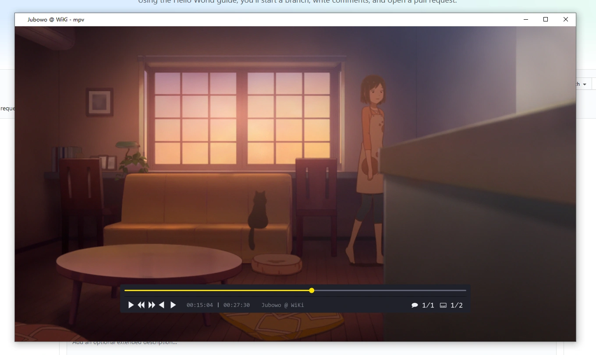

# mpv-dark-box

This is a fork of the original [maoiscat/mpv-dark-box](https://github.com/maoiscat/mpv-dark-box) with following fixes:

* Re-enabled the volume display, which was hidden by the original author.
* Applied a fix to ensure compatibility with mpv v0.37.0 and newer. (Thanks to @Samillion in [this issue comment](https://github.com/0dist/oscc/issues/6#issuecomment-2387559031)).
* README.md translated to English and cleaned up.

## Description

It's a custom On-Screen-Controller (OSC) for mpv, based on the native `osc.lua` framework. The visual style is inspired by the [MPV-EASY-Player project](https://github.com/422658476/MPV-EASY-Player/blob/master/mpv-easy-data/osc-style/osc-potplayer-box-knob-or-bar-0.lua).



## Installation

1. Download the `dark-box.lua` file from this repository.
2. Place the `dark-box.lua` file into your mpv `scripts` directory.
  * **Windows:** `%APPDATA%/mpv/scripts/`
  * **Linux/macOS:** `~/.config/mpv/scripts/`
3. Add the following lines to your `mpv.conf`:

```conf
# mpv.conf
# Required change:
# This disables the default OSC so our script can run.
osc=no
# Optional yet recommended changes:
# Font optionally needs to be installed on Linux/Mac, it exists on Windows by default
font=Consolas
[Auto.Idle]
profile-cond=p["idle-active"]
profile-restore=copy-equal
osd-playing-msg=' '
title=' '
background=1.0
geometry=640
```
